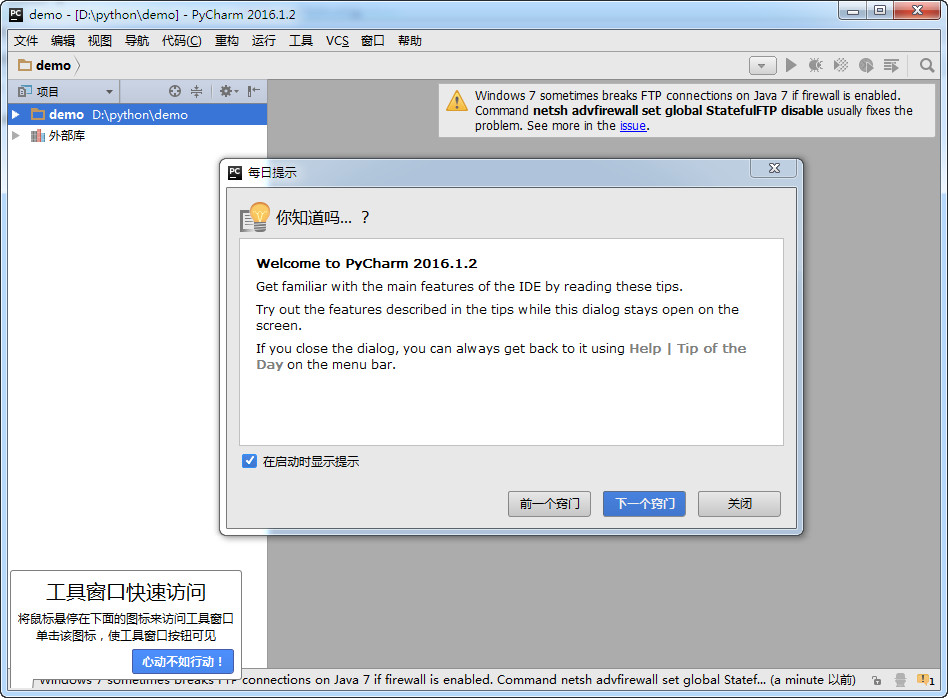
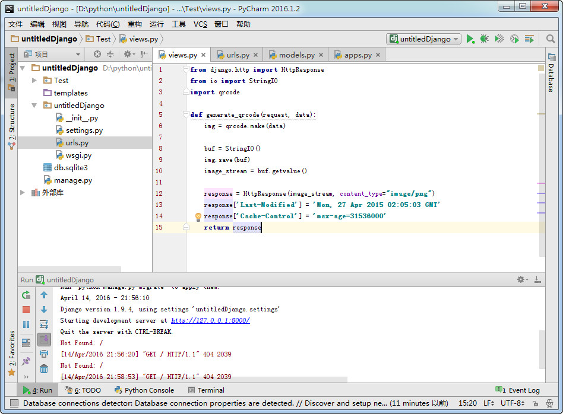

# PyCharm-Chinese
PyCharm Chinese Language Pack（中文语言包）

把压缩包里的"resources_zh_CN.jar"拷贝到PyCharm安装目录下的lib目录，重启即可！

主要是扫描WebStorm的翻译，做的这个中文语言包，汉化程度有限……

同系列：[WebStorm 中文语言包](https://github.com/ewen0930/WebStorm-Chinese) 、 [PhpStorm 中文语言包](https://github.com/ewen0930/PhpStorm-Chinese)和 [IDEA 中文语言包](https://github.com/ewen0930/IDEA-Chinese)

另外由 @pingfangx 汉化的 Android Studio 在[这里](https://github.com/pingfangx/TranslatorX/releases)